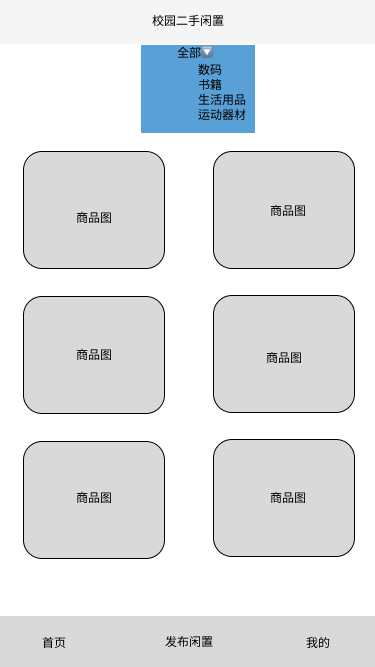
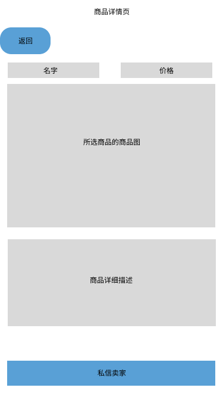
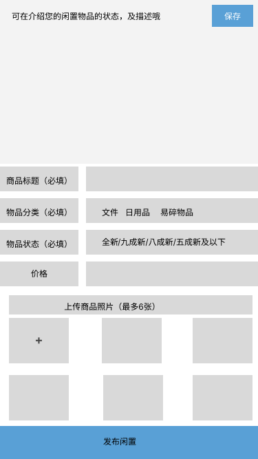
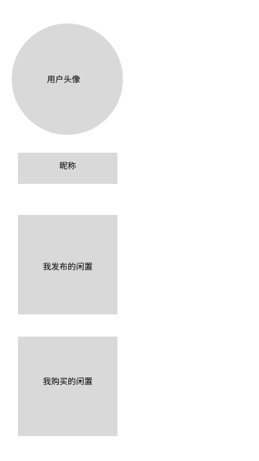

```
# PRD产品需求文档｜校园二手闲置小程序 V1.0
## 文档信息
- 产品名称：校园二手闲置小程序
- 版本：V1.0
- 编写人：应届生个人练习项目
- 目标上线范围：单高校学生群体
- 阅读对象：产品、开发、测试人员
- 产品定位：校园二手物品信息撮合平台，不提供线上支付服务

## 一、产品目标
1. 给本校学生提供轻量化闲置物品发布渠道；
2. 建立结构化的二手商品展示页面，解决QQ群信息杂乱的痛点；
3. 提供买卖双方私信沟通渠道，推荐校园面对面验货交易；
4. MVP最小闭环验证校园二手产品价值。

## 二、产品范围说明
✅ V1.0包含功能：微信登录、发布闲置、发布求购、商品浏览、详情查看、私信聊天、个人发布管理、基础分类筛选
❌ V1.0不包含：支付、订单、物流、评价、搜索、举报、收藏

## 三、角色定义
- 普通学生用户：使用全部基础功能，发布商品、发起私信。

## 四、全局规则
1. 用户必须微信授权登录之后才能发布商品、发送私信；
2. 所有交易风险由交易双方自行承担；小程序只作为信息展示载体；
3. 禁止发布违规物品（管制用品、食品、化妆品等）；
4. 商品默认按照发布时间倒序展示，最新发布排在首页最上方。

## 五、功能详细需求
### 模块1：微信授权登录页面
1. 功能描述：用户首次进入小程序，唤起微信授权获取昵称头像，选择所在学校；
2. 前置条件：未登录状态；
3. 操作：点击【微信一键登录】；
4. 异常场景：用户拒绝授权 → 提示登录失败，无法使用发布和私信功能，仅可浏览商品。

### 模块2：首页闲置列表页
1. 功能描述：展示全部本校用户发布的闲置商品卡片；
2. 字段展示：商品缩略图、标题、标价、物品分类、发布时间；
3. 筛选功能：顶部下拉选择物品分类筛选；
4. 操作：点击商品卡片跳转详情页；点击底部【发布闲置】跳转到发布表单。

### 模块3：发布闲置表单页
1. 输入项：
    - 商品标题（必填，最多30个字）
    - 物品分类（下拉选择：书籍 / 数码 / 生活用品 / 运动器材）
    - 成色选择：全新 / 九成新 / 八成新 / 五成新及以下
    - 期望价格（数字输入，支持0元赠送）
    - 商品描述（选填，最多200字）
    - 上传图片（最多6张）
2. 校验规则：标题不能为空；价格必须是非负数字；
3. 提交成功提示：发布成功；返回首页查看自己的商品；
4. 提交失败：给出明确文字提示（例：标题不能为空）。

### 模块4：商品详情页
1. 展示内容：多张轮播图片、标题、价格、成色、分类、描述、发布者头像昵称；
2. 操作按钮：【私信卖家】；
3. 未登录用户点击私信，跳转登录弹窗。

### 模块5：发布求购功能
1. 用户填写求购标题、想要的物品描述、期望预算；
2. 提交之后展示在独立的求购信息流；
3. 其他卖家看到后可以主动私信求购用户。

### 模块6：一对一私信聊天
1. 功能描述：买卖双方在线文字沟通；
2. 限制：登录用户才可发送消息；
3. 消息实时展示；无撤回、图片消息（V1简化）。

### 模块7：个人中心页面
1. 展示用户头像昵称；
2. 菜单：我发布的闲置｜我发布的求购；
3. 点击条目可以查看自己发布的内容。

## 六、埋点设计（数据科学专业加分模块）
> 产品埋点用于后续数据分析，指导产品迭代优化
1. 首页曝光埋点：统计首页商品浏览量；
2. 商品点击埋点：统计每个商品详情页访问次数；
3. 发布按钮点击埋点：统计发布功能点击率；
4. 私信发起埋点：统计用户咨询转化率；
5. 分类筛选埋点：统计学生高频关注的物品品类。

后续可以通过埋点数据分析：哪一类二手物品活跃度最高，判断下一个版本优先迭代什么功能。

## 七、非功能需求
1. 性能：页面加载控制在2秒以内；
2. 合规提示：页面增加交易风险提示，提醒学生线下交易注意安全；

## 八、页面低保真草图参考




> 使用Figma手绘低保真原型，展示页面布局与模块划分。
```
