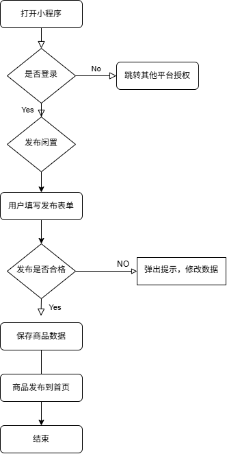
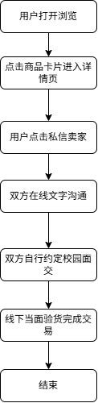

# 业务流程说明文档
## 1. 业务流程图说明
两张核心业务流程图使用Draw.io绘制，导出PNG保存至images文件夹：
1. 用户发布闲置完整流程
2. 用户咨询沟通交易流程

## 2. 流程1：发布闲置业务流程
1. 用户打开小程序；
2. 判断是否登录；未登录跳转微信授权；
3. 登录完成，点击【发布闲置】按钮；
4. 用户填写表单：标题、分类、成色、期望价格、文字描述、上传图片；
5. 前端校验：标题不为空，价格为合法数字；
6. 校验失败：弹出提示，引导用户修改内容；
7. 校验成功，提交数据保存；
8. 商品成功上架，展示在首页闲置列表；
9. 其他用户可以浏览该商品详情。

## 3. 流程2：买家咨询沟通流程
1. 用户在首页浏览闲置列表；
2. 点击商品卡片进入商品详情；
3. 用户点击【私信卖家】按钮；
4. 打开一对一聊天窗口；
5. 买卖双方在线沟通价格、交货地点；
6. 双方自行约定校园线下当面交易；
7. 整个交易过程小程序不介入资金与履约环节。

## 4. 页面流转关系
首页 → 商品详情页 → 私信聊天页
首页 → 发布闲置表单页
首页 → 发布求购表单页
底部Tab切换：首页 / 个人中心
个人中心 → 我的发布列表
