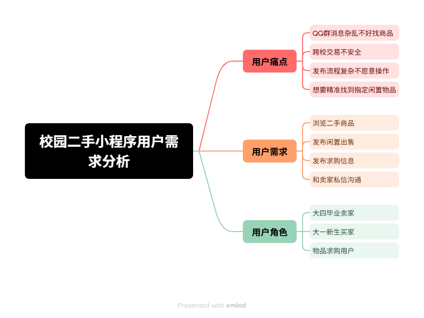

# 用户调研与用户画像
## 1. 调研方式
模拟定性用户访谈，选取10名不同年级在校大学生进行需求收集，整理真实使用痛点与期望。

## 2. 用户痛点汇总
1. 毕业季、学期结束，大量教材、生活用品闲置，处理麻烦；
2. QQ群二手消息刷走，想要找的物品很难再次找到；
3. 在闲鱼购买二手，很难确认对方是本校学生，验货不方便；
4. 想买特定二手教材、器材时，只能在群里反复刷屏求购；
5. 担心线上交易被骗，学生更愿意线下当面看货交易；
6. 不想下载独立APP，更愿意使用微信小程序打开即用。

## 3. 用户画像
### 画像A｜毕业卖家（大三/大四学生）
- 基本信息：21–23岁，即将离校；
- 用户场景：宿舍书本、小家电、运动器材带不走，希望快速低价出手；
- 用户目标：简单快速发布物品，快速对接本校买家；
- 用户顾虑：流程复杂不想填写大量信息，担心遇到不靠谱买家。

### 画像B｜新生买家（大一学生）
- 基本信息：18–20岁，刚入学；
- 用户场景：需要教材、收纳用品、电风扇等宿舍物资，预算有限；
- 用户目标：找到价格实惠的本校二手商品，可以当面验货；
- 用户顾虑：商品成色和图片不符，交易不安全。

### 画像C｜求购用户（全年级通用）
- 基本信息：在校任意年级；
- 用户场景：想要收购特定绝版教材、游戏手柄、运动装备；
- 用户目标：主动发布求购，等待有货的卖家主动联系自己；
- 用户顾虑：发布的求购信息曝光不足，没有人看到。

## 4. 用户需求分类
1. 基础需求：浏览二手商品，查看图文详情；
2. 期望需求：发布闲置、发布求购，私信沟通；
3. 兴奋需求：精准校园身份筛选，纯净无广告的交易环境。

## 5. 思维导图说明

> XMind Online导出，梳理用户角色、痛点、需求关系。
